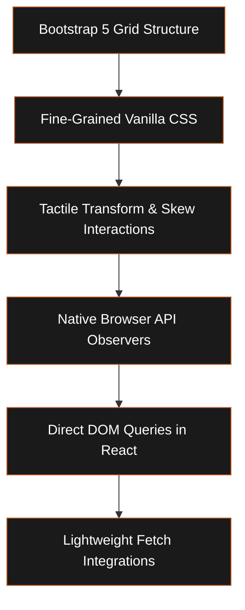
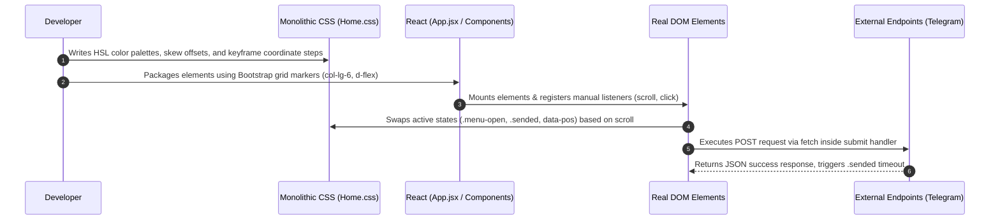

# Developer Profile - Complete Developer DNA

**Related:** [[UI Philosophy]] · [[CSS Philosophy]] · [[JavaScript Style]] · [[Architecture]] · [[Performance]] · [[UX Decisions]] · [[Reusable Patterns]] · [[Skill Tree]] · [[Weaknesses]] · [[Learning Roadmap]]

This profile outlines the developer DNA of a highly specialized, visual-first **Frontend & Interaction Engineer**. By analyzing every file in this workspace, this profile documents the developer's styling conventions, logic structures, architectural patterns, and user experience implementations with pixel-level precision.

---

## 1. Developer Archetype: The Tactile Motion Architect

The developer's coding style is defined by a primary focus on the **physical feel of web interfaces**. They operate at the boundary where raw CSS styling becomes interactive logic.

### Core Strengths Identified
1. **Dynamic CSS Keyframing**: Leverages complex visual layout shifting via native CSS keyframe rules using coordinates and math variables.
2. **Visual Hierarchy & Typography**: Integrates distinct, styled serif headers (`Young Serif`) alongside geometric text sizes (`Montserrat`, `Lexend`) to achieve an editorial feel.
3. **Advanced CSS State Machines**: Utilizes parent-aware selectors (`:has()`), validation filters (`:valid`), focus indicators (`:focus`), and layout targets (`:first-child`, `:last-child`) to shift component animations dynamically, bypassing heavy state models.
4. **Custom Browser APIs**: Employs manual `IntersectionObserver` loops to optimize visual resources.
5. **Serverless Form Handling**: Uses direct fetch routing to third-party endpoints (Telegram Bot API) to deploy serverless form submissions without backend server overhead.

---

## 2. Vault Map & Index

Select any chapter to view detailed code snippets, coordinates, colors, and layout instructions:

*   **[[UI Philosophy]]**: Visual aesthetics, curves, organic masks, overlapping card slots, and guide details.
*   **[[CSS Philosophy]]**: Precise variable values, color ranges (HSL), easing curves, keyframe declarations, and mobile circle menus.
*   **[[JavaScript Style]]**: Dynamic class bindings, hook implementations, ES6 OOP classes, and Telegram submit handlers.
*   **[[Architecture]]**: Folder directory mapping, component linkages, Redux configuration slices, and framework dependencies.
*   **[[Performance]]**: Performance metrics, custom observer blocks, hardware acceleration, and SVG masking rules.
*   **[[UX Decisions]]**: Focus pointer tracking, real-time input status indicators, scroll-direction classes, and submenu routes.
*   **[[Reusable Patterns]]**: Complete code patterns for forms, star ratings, link kapsules, and curved frames.
*   **[[Skill Tree]]**: Exact ratings of technologies, styling libraries, and visual APIs.
*   **[[Weaknesses]]**: Review of DOM syncing bugs, plain-text security tokens, component styling structure fragmentation, and empty code stubs.
*   **[[Learning Roadmap]]**: Concrete milestones to address structural gaps, modularize code, and secure configuration variables.

---

## 3. High-Level Development Blueprint

---

*This vault documents code structure and styling details from the workspace codebase as of June 2026.*
