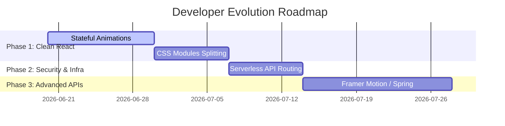

# Developer Learning Roadmap - Evolution Milestones

**Related:** [[Weaknesses]] · [[Skill Tree]] · [[Developer Profile]]

This roadmap provides actionable milestones to help the developer transition their direct DOM scripting approach into clean React paradigms, secure API setups, and highly optimized component architectures.



---

## Milestone 1: Refactoring to Stateful React Animations

**Goal**: Replace all instances of `document.querySelector` with React refs or reactive component states to leverage React's Virtual DOM.

### 1. Refactoring `Service.jsx`
- Replace direct DOM queries with an active state index:
```javascript
import React, { useState } from 'react';

function Service() {
    const [activePos, setActivePos] = useState(0);

    const handleService = (pos) => {
        setActivePos(pos);
    };

    return (
        <section className="service container">
            {/* Bind active class using template literals based on state */}
            <div 
                className={`service-items ${activePos === 0 ? 'active' : ''}`} 
                onClick={() => handleService(0)}
            >
                <h5>Digital Marketing</h5>
            </div>
            
            {/* Bind data-pos to state index to trigger keyframe transitions */}
            <div className="service-bg" data-pos={activePos}></div>
        </section>
    );
}
```

### 2. Managing Scroll States via React Hooks
- Refactor global scroll listeners in `App.jsx` to map to local component states:
```javascript
const [scrollDirection, setScrollDirection] = useState('on-top');

useEffect(() => {
    let lastScrollTop = 0;
    const handleScroll = () => {
        const scrollTop = window.scrollY;
        if (scrollTop > 100) {
            setScrollDirection(scrollTop > lastScrollTop ? 'down' : 'up');
        } else {
            setScrollDirection('on-top');
        }
        lastScrollTop = scrollTop;
    };
    document.addEventListener('scroll', handleScroll);
    return () => document.removeEventListener('scroll', handleScroll);
}, []);
```

---

## Milestone 2: Code Security and Key Protection

**Goal**: Remove all plain-text secrets and tokens from the frontend codebase.

- **Action Items**:
  1. Add a `.env` file to the root directory to store configuration variables securely:
     ```env
     VITE_TELEGRAM_BOT_TOKEN=7705611985:AAHgqolW_zjqLOezUaB1TtJf1xdQ2-rAkDA
     VITE_TELEGRAM_GROUP_CHAT_ID=-1002266213746
     ```
  2. Add the `.env` file to `.gitignore` to prevent credentials from being pushed to public repositories.
  3. Reference the variables in React using Vite's env object:
     ```javascript
     const botToken = import.meta.env.VITE_TELEGRAM_BOT_TOKEN;
     const chatId = import.meta.env.VITE_TELEGRAM_GROUP_CHAT_ID;
     ```

---

## Milestone 3: CSS Modularization & Code-Splitting

**Goal**: Break up monolithic stylesheets to decrease initial bundle sizes.

- **Action Items**:
  1. Split `Home.css` into separate CSS modules located alongside their respective components (e.g. `About.module.css`, `Team.module.css`).
  2. Use CSS Modules in React templates to scope styles automatically:
     ```javascript
     import styles from './About.module.css';
     
     function About() {
         return <section className={styles.aboutContainer}></section>;
     }
     ```
  3. Clean up dead CSS definitions (commented-out blocks and overrides).

---

## Milestone 4: Modern Motion Libraries

**Goal**: Build on the developer's excellent animation instincts using robust animation libraries.

- **Action Items**:
  - Learn **Framer Motion** or **React Spring** to replace manual cubic-bezier class toggling.
  - Implement spring-physics animations for more organic movement (like waving hands and card shifts).
  - Use standard React observers to trigger entry animations when elements enter the screen.

