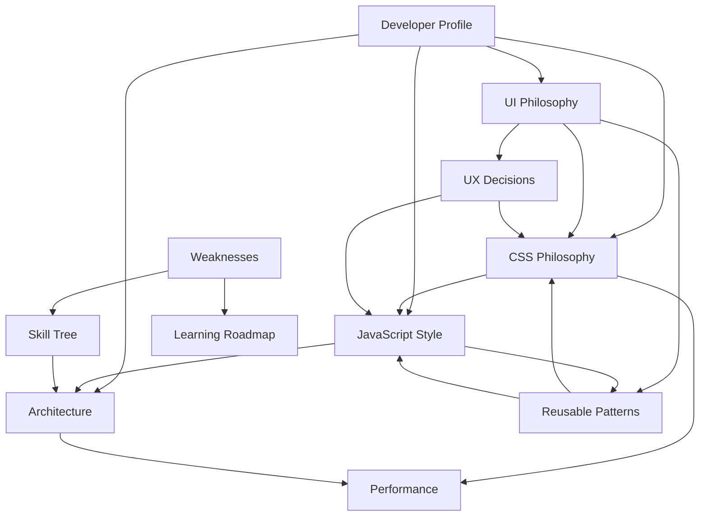

# Developer DNA — Index

> Obsidian vault reverse-engineered from the **val** frontend workspace: Bootstrap grid, organic CSS motion, React DOM controllers, Telegram form hooks.

Open [[Developer Profile]] first for the complete narrative.

---

## Vault Map

---

## Files

| Note | Focus |
|------|-------|
| [[Developer Profile]] | Archetype, vault index, development blueprint |
| [[UI Philosophy]] | Organic modernism, curves, masks, tactile guides |
| [[CSS Philosophy]] | HSL variables, easing, keyframes, mobile menus |
| [[JavaScript Style]] | Class bindings, hooks, ES6 classes, Telegram handlers |
| [[Architecture]] | Folder map, Redux slices, routing, dependencies |
| [[Performance]] | Observers, GPU layers, SVG masking rules |
| [[UX Decisions]] | Focus tracking, scroll classes, submenu routes |
| [[Reusable Patterns]] | Forms, star ratings, link kapsules, curved frames |
| [[Skill Tree]] | Technology and library ratings |
| [[Weaknesses]] | DOM sync bugs, token exposure, styling fragmentation |
| [[Learning Roadmap]] | Modularization and security milestones |

---

## How to Use This Vault

1. **New page / visual design** → Profile + UI Philosophy + CSS Philosophy
2. **Animation / CSS work** → CSS Philosophy + Performance + Reusable Patterns
3. **React / JS task** → JavaScript Style + Architecture
4. **UX / interaction** → UX Decisions + CSS Philosophy
5. **Code review** → Weaknesses + Skill Tree
6. **Improvement planning** → Weaknesses + Learning Roadmap

Cross-links use Obsidian wikilinks. Follow **Related:** headers at the top of each note for navigation.
