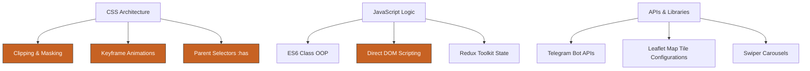

# Developer Skill Tree - Core Competencies

**Related:** [[Architecture]] · [[CSS Philosophy]] · [[Weaknesses]] · [[Developer Profile]]

This skill tree evaluates your proficiencies based on the coding style, frameworks, logic structures, and styling techniques identified in the project.

---

## 1. Skill Matrix

### Frontend & Layout Styling
- **HTML5 & Semantic Structure**: ★★★★★ [Expert]
  - Fluent with SEO metadata tagging, HTML5 sections (`header`, `footer`, `section`), attributes (`pre-loader`, `img-loader`), and custom document structures.
- **CSS Grid, Flexbox, & Layouts**: ★★★★★ [Expert]
  - Fluent with fluid layouts, alignment grids, responsive ordering, and responsive positioning.
- **CSS Clipping, Masking, & Vectors**: ★★★★★ [Expert]
  - Expert implementation of `clip-path` (ellipse curves and circular ripple reveals) and SVG image masking (`mask-image` linked to CDN icons and custom path silhouettes).
- **Interactive CSS States**: ★★★★★ [Expert]
  - Expert use of parent selectors (`:has()`), validation filters (`:valid`), focus indicators (`:focus`), and pseudo-elements (`::before`, `::after`) to build interactive state engines directly in CSS.
- **Tailwind CSS**: ★★☆☆☆ [Beginner]
  - Tailwind dependencies are present, but the styling style favors scoped vanilla CSS files.

### JavaScript & Logic Architectures
- **React Core Hooks & Contexts**: ★★★★☆ [Advanced]
  - Proficient with JSX templates, functional layout definitions, hooks (`useState`, `useEffect`), routing interfaces (`Routes`, `Route`, `NavLink`), and state integrations.
- **Direct DOM Integration**: ★★★★★ [Expert]
  - Fluent with manual element query loops (`document.querySelector`, `querySelectorAll`), class lists, custom observers (`IntersectionObserver`), and direct DOM event listeners inside React lifecycles.
- **Redux Toolkit & Slices**: ★★★☆☆ [Intermediate]
  - Basic setup for store configurations and theme persistence state management.
- **ES6 Class-Based Programming**: ★★★★☆ [Advanced]
  - Structured OOP class designs (constructors, method binders, scroll listeners) inside custom scripts.

### Third-Party APIs & Libraries
- **Leaflet & React Leaflet**: ★★★★☆ [Advanced]
  - Leaflet map integration, dark mode tile layers (`Stadia Maps`), custom markers (`L.Icon`), coordinate scaling, and popup windows.
- **Swiper & Slide Interfaces**: ★★★★☆ [Advanced]
  - Responsive carousels, touchscreen control setups, pagination modules, autoplay loops, and viewport breakpoints.
- **Telegram Bot APIs**: ★★★★☆ [Advanced]
  - Serverless form routes, payload configurations, and validation models.

---

## 2. Skill Graph

