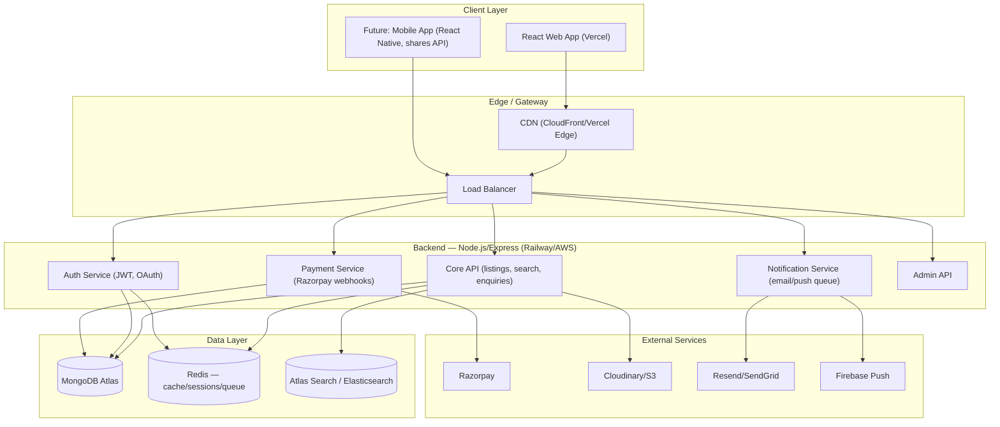
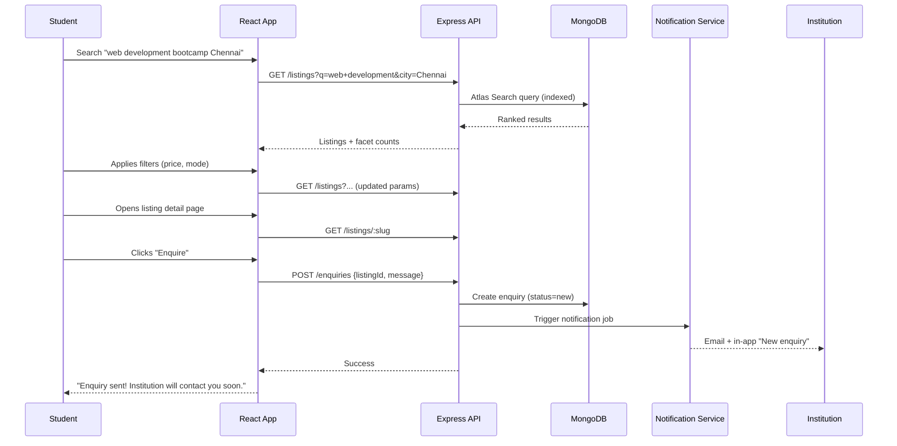
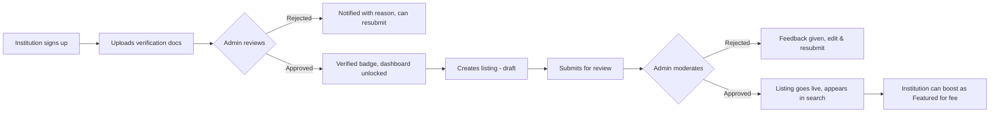
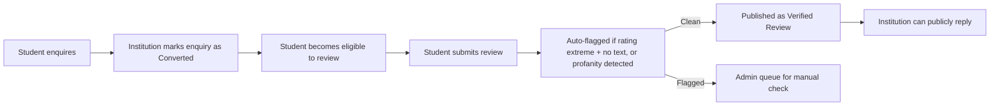

# SkillVentures — Complete Production Development Plan
### Courses, Bootcamps & Hackathons Discovery Platform (MERN Stack)

> This is a build plan for a **real, production-grade product** — not a demo/portfolio project. Every section is written so it can be handed directly to a dev (even solo-you) and executed without re-deriving decisions later.

---

## 1. Product Summary

**SkillVentures** is a two-sided marketplace connecting **students** (looking for courses, bootcamps, hackathons) with **institutions** (colleges, training centers, EdTech companies, bootcamp/hackathon organizers) who list and promote their offerings.

**Core value loop:**
Student searches → discovers relevant listing → views details/reviews → enquires/applies → Institution receives lead → Institution pays for visibility/leads → SkillVentures earns revenue.

Everything in this plan is built around making that loop **fast, trustworthy, and frictionless** on both sides.

---

## 2. User Roles (RBAC)

| Role | Access |
|---|---|
| **Student (Guest)** | Browse/search public listings, no login required |
| **Student (Registered)** | Save/bookmark, apply/enquire, write reviews, track applications |
| **Institution (Unverified)** | Sign up, submit listings for review, limited dashboard |
| **Institution (Verified/Paid)** | Full dashboard, analytics, featured listings, lead access |
| **Admin** | Approve institutions/listings, moderate reviews, manage payments, view platform analytics |
| **Super Admin** | Admin management, system config, financial reports |

Role separation must be enforced **server-side** on every route (JWT + role middleware) — never trust client-side role checks alone.

---

## 3. Full Feature Scope

### 3.1 Student-Facing
- Search (keyword, autocomplete, typo-tolerant)
- Filters: price range, location (city/state/online), mode (online/offline/hybrid), category, duration, rating, placement support
- Course / Bootcamp / Hackathon detail pages (fees, eligibility, duration, curriculum, placement stats, institution profile link)
- Reviews & ratings (only from verified applicants — prevents fake reviews)
- Institution profile pages (all their listings, verified badge, reviews)
- Enquiry/Apply flow (single form, reusable profile data — no re-typing every time)
- Bookmarks / Saved listings
- Application tracker ("My Applications" dashboard: Enquired → Contacted → Enrolled)
- Notifications (email + in-app): new matching courses, application status change
- Comparison tool (compare 2–3 courses/institutions side by side)
- Location-based "near me" search (Geo-indexed)

### 3.2 Institution-Facing
- Institution registration + document verification (upload registration/accreditation docs)
- Listing management (create/edit/pause courses, bootcamps, hackathons) — draft → pending review → published
- Lead/enquiry inbox with status pipeline (New → Contacted → Converted → Lost)
- Analytics dashboard: views, enquiries, conversion rate, top-performing listings
- Subscription & billing management (plan, invoices, upgrade/downgrade)
- Featured listing purchase (self-serve boost, time-bound)
- Review responses (institutions can publicly reply to reviews)

### 3.3 Admin Panel
- Institution verification queue (approve/reject with reason)
- Listing moderation queue
- Review moderation (flag/remove abusive or fake reviews)
- User management (suspend/ban)
- Revenue dashboard (subscriptions, featured listings, ads — MRR, churn)
- Content management (homepage banners, categories, blog/SEO pages)
- Support ticket / dispute handling

### 3.4 Platform-Wide (Cross-cutting)
- Global search with Elasticsearch (or MongoDB Atlas Search) — not just regex `find()`, this must scale
- SEO-friendly URLs & server-side rendering for listing/institution pages (critical for organic discovery traffic — your real growth channel)
- Multi-city/location support
- Responsive design — mobile-first (60–70% of Indian student traffic is mobile)
- Accessibility basics (WCAG AA where feasible)

---

## 4. Tech Stack (MERN, production-scoped)

| Layer | Choice | Why |
|---|---|---|
| Frontend | **React 18 + Vite**, TypeScript | Type safety at this scale is non-negotiable for a solo/small team — catches bugs before prod |
| State/Data | **React Query (TanStack Query)** + Zustand/Redux Toolkit (only for auth/global UI state) | Server state ≠ client state; don't cram API data into Redux |
| Styling | Tailwind CSS + shadcn/ui | Fast, consistent, accessible components out of the box |
| Backend | **Node.js + Express (TypeScript)** | Matches frontend types via shared types package |
| Database | **MongoDB Atlas** (managed, not self-hosted) | Built-in backups, scaling, Atlas Search |
| Search | MongoDB Atlas Search (start) → Elasticsearch (if scale demands) | Avoid premature complexity; Atlas Search covers 80% of needs |
| Auth | JWT (access + refresh token rotation) + bcrypt; OAuth (Google) for students | Refresh rotation prevents long-lived token theft risk |
| File/Image storage | Cloudinary or AWS S3 + CloudFront | Never store uploads on app server disk |
| Payments | Razorpay (India-first) | UPI/cards/netbanking support, subscription APIs |
| Email | Resend or SendGrid | Transactional emails (enquiry confirmations, status updates) |
| Notifications | Firebase Cloud Messaging (push) + email | |
| Hosting (Frontend) | Vercel | |
| Hosting (Backend) | Railway / Render initially → AWS ECS/EC2 at scale | Don't over-engineer infra on day 1 |
| CI/CD | GitHub Actions | Auto-test + deploy on merge to main |
| Monitoring | Sentry (errors) + Better Uptime (uptime) + Atlas metrics | You need to know when it breaks before users tell you |
| Caching | Redis (session store, rate limiting, hot-listing cache) | |

**Why TypeScript everywhere:** at 5-lakh-project stakes, a runtime `undefined is not a function` in production is not acceptable. Type safety is the cheapest insurance you can buy.

---

## 5. System Architecture



**Key architectural decisions:**
1. **Modular monolith first, not microservices.** At your stage, microservices add operational overhead (multiple deployments, service discovery, distributed tracing) without a payoff — you don't have the traffic to justify it. Structure the Express app in clean **modules** (`auth/`, `listings/`, `payments/`, `admin/`) so it *can* be split later if needed.
2. **Redis from day 1** — not optional. Used for: session/refresh-token storage, rate limiting (prevent scraping/spam enquiries), caching hot search queries and homepage data.
3. **Webhooks for payments**, never trust client-side "payment successful" callbacks — always verify via Razorpay webhook signature server-side before marking subscription active.
4. **Search is a first-class concern**, not an afterthought — build the schema with search indexing in mind from the start (denormalize category/location fields onto listing docs for fast filtering).

---

## 6. Database Design (MongoDB — Collections & Key Fields)

```
users
├─ _id, role [student|institution|admin], name, email, phone, passwordHash
├─ authProvider [local|google], isVerified, isBanned
├─ profile: { avatar, city, currentEducationLevel } (students)
├─ createdAt, updatedAt

institutions
├─ _id, userId (ref users), name, type [college|university|training-institute|edtech|bootcamp-provider]
├─ description, logo, coverImage, website
├─ verificationStatus [pending|verified|rejected], verificationDocs: [urls]
├─ location: { city, state, address, geo: {type:"Point", coordinates} }
├─ subscriptionPlan [free|standard|premium], subscriptionExpiresAt
├─ rating: { avg, count }
├─ createdAt, updatedAt

listings                      # unified collection for courses/bootcamps/hackathons
├─ _id, institutionId (ref), type [course|bootcamp|hackathon]
├─ title, slug (unique, SEO), description, category, subCategory
├─ fee: { amount, currency, isFree }, duration: { value, unit }
├─ mode [online|offline|hybrid], location (if offline/hybrid)
├─ eligibility, curriculum: [ {title, description} ], placementSupport: Boolean
├─ certificateProvided: Boolean
├─ images: [urls], status [draft|pending_review|published|paused|rejected]
├─ isFeatured: Boolean, featuredUntil
├─ type-specific fields:
│   bootcamp: { startDate, endDate, sessionMode, seatsAvailable }
│   hackathon: { startDate, endDate, prizePool, teamSizeMax, sponsors: [] }
├─ stats: { views, enquiries }
├─ rating: { avg, count }
├─ createdAt, updatedAt
├─ INDEX: text index on (title, description, category); geo index on institution location; compound index (category, mode, "fee.amount")

enquiries
├─ _id, studentId (ref), listingId (ref), institutionId (ref)
├─ message, contactInfo snapshot {name, phone, email}
├─ status [new|contacted|converted|lost]
├─ createdAt, updatedAt
├─ INDEX: compound (institutionId, status), (studentId)

reviews
├─ _id, studentId (ref), listingId (ref), institutionId (ref)
├─ rating (1-5), comment, isVerifiedApplicant (only true if enquiry.status=converted)
├─ institutionReply: { text, repliedAt }
├─ moderationStatus [visible|flagged|removed]
├─ createdAt

bookmarks
├─ _id, studentId (ref), listingId (ref), createdAt

subscriptions
├─ _id, institutionId (ref), plan, amount, razorpaySubscriptionId
├─ status [active|cancelled|past_due], currentPeriodEnd
├─ invoices: [ {id, amount, paidAt, pdfUrl} ]

notifications
├─ _id, userId (ref), type, title, body, isRead, relatedEntityId, createdAt
```

**Notes:**
- `listings` unified collection (with `type` discriminator) instead of 3 separate collections — simplifies search across all types, still lets you branch UI/logic by type.
- **Never store raw review content from unverified applicants as "verified"** — this directly protects the trust signal that makes your whole platform credible. This is a business-critical integrity rule, enforce it in the schema/service layer, not just the UI.

---

## 7. API Design (REST, versioned `/api/v1`)

```
Auth
POST   /auth/register/student
POST   /auth/register/institution
POST   /auth/login
POST   /auth/refresh
POST   /auth/logout
POST   /auth/google

Listings (public)
GET    /listings                 ?type&category&city&mode&minFee&maxFee&rating&page
GET    /listings/:slug
GET    /listings/search?q=

Listings (institution, protected)
POST   /institutions/me/listings
PUT    /institutions/me/listings/:id
DELETE /institutions/me/listings/:id
GET    /institutions/me/listings

Institutions (public)
GET    /institutions/:id
GET    /institutions/:id/listings

Enquiries
POST   /enquiries                (student → creates enquiry)
GET    /students/me/enquiries
GET    /institutions/me/enquiries          ?status
PATCH  /institutions/me/enquiries/:id      (update status)

Reviews
POST   /reviews
GET    /listings/:id/reviews
POST   /reviews/:id/reply        (institution)

Bookmarks
POST   /bookmarks/:listingId
DELETE /bookmarks/:listingId
GET    /students/me/bookmarks

Payments/Subscriptions
POST   /subscriptions/create-order
POST   /subscriptions/webhook     (Razorpay signature-verified)
GET    /institutions/me/subscription

Admin
GET    /admin/institutions?status=pending
PATCH  /admin/institutions/:id/verify
GET    /admin/listings?status=pending_review
PATCH  /admin/listings/:id/moderate
GET    /admin/analytics
```

Every protected route: `authenticate` middleware (verifies JWT) → `authorize(role)` middleware → controller. Every list endpoint: pagination (`page`, `limit`, max limit capped server-side to prevent abuse) + rate limiting via Redis.

---

## 8. Project Folder Structure

```
skillventures/
├── apps/
│   ├── client/                      # React app
│   │   ├── src/
│   │   │   ├── components/          # shared UI (Button, Card, etc.)
│   │   │   ├── features/            # feature-sliced: auth/, listings/, enquiries/, admin/
│   │   │   ├── hooks/
│   │   │   ├── lib/                 # api client, query client config
│   │   │   ├── pages/ (or routes/)
│   │   │   └── types/
│   │   └── vite.config.ts
│   └── server/                      # Express API
│       ├── src/
│       │   ├── modules/
│       │   │   ├── auth/            # controller, service, routes, validation
│       │   │   ├── listings/
│       │   │   ├── institutions/
│       │   │   ├── enquiries/
│       │   │   ├── reviews/
│       │   │   ├── payments/
│       │   │   └── admin/
│       │   ├── middleware/          # auth, error handler, rate-limit
│       │   ├── models/              # Mongoose schemas
│       │   ├── config/              # db, redis, env
│       │   ├── jobs/                # background jobs (email queue, cleanup)
│       │   └── utils/
│       └── tests/
├── packages/
│   └── shared-types/                 # TS types shared between client & server
├── .github/workflows/                # CI/CD
└── docker-compose.yml                # local dev: mongo, redis
```

**Why a monorepo with shared-types:** guarantees the frontend and backend never drift out of sync on data shape — a huge source of "flawless in dev, broken in prod" bugs.

---

## 9. Core User Workflows

### 9.1 Student Discovery → Enquiry Flow


### 9.2 Institution Onboarding → Listing Publish Flow


### 9.3 Review Trust Flow (integrity-critical)


---

## 10. Non-Functional Requirements (what "flawless" actually means)

| Requirement | Target |
|---|---|
| API response time | P95 < 300ms for reads, < 800ms for writes |
| Search response | < 500ms for typical filtered query |
| Uptime | 99.5%+ (managed hosting + health checks + alerting) |
| Concurrent users (MVP target) | 500 concurrent, scalable design to 5,000+ |
| Mobile responsiveness | 100% of pages usable at 360px width |
| Data validation | Every input validated server-side (Zod schemas) — never trust client validation alone |
| Security | OWASP Top 10 covered (see §11) |
| Backups | Daily automated Atlas backups, 7-day retention minimum |
| SEO | Server-rendered/pre-rendered listing pages, sitemap.xml, structured data (JSON-LD Course schema) |

---

## 11. Security Checklist (non-negotiable at this stakes level)

- [ ] Passwords: bcrypt (cost factor ≥ 12), never store plaintext
- [ ] JWT: short-lived access token (15 min) + HttpOnly refresh token (7 days, rotated on use)
- [ ] Input validation: Zod on every endpoint, reject unknown fields
- [ ] Rate limiting: per-IP and per-user (Redis-backed), stricter on auth & enquiry endpoints (prevent spam/scraping)
- [ ] CORS: explicit allow-list, never `*` in production
- [ ] Helmet.js for HTTP security headers
- [ ] MongoDB: parameterized queries only (Mongoose prevents injection by default — don't bypass with raw `$where`)
- [ ] File uploads: validate MIME type + size server-side, scan before serving, store outside app server (S3/Cloudinary)
- [ ] Payment webhook signature verification (Razorpay) — mandatory before crediting any subscription
- [ ] Admin routes: additional IP-based or 2FA protection
- [ ] Audit log for admin actions (who approved/rejected what, when)
- [ ] Secrets in environment variables / secret manager, never committed to git
- [ ] Dependency scanning (GitHub Dependabot / `npm audit`) in CI

---

## 12. Testing Strategy

| Layer | Tooling | Coverage target |
|---|---|---|
| Unit (services/utils) | Jest | Core business logic (pricing, matching, status transitions) |
| API integration | Jest + Supertest | Every endpoint — happy path + auth failure + validation failure |
| Frontend component | Vitest + React Testing Library | Critical flows: search, enquiry form, listing card |
| E2E | Playwright | Full user journeys: signup → search → enquire; institution → publish listing |
| Load testing | k6 | Before launch: simulate 500 concurrent searches |

**Non-negotiable:** the enquiry flow, payment flow, and auth flow get E2E test coverage before every deploy to production — these are the three places a silent bug directly costs you money or trust.

---

## 13. Development Roadmap (Phased, not "all at once")

### Phase 0 — Foundation (Week 1–2)
- Repo setup (monorepo, TS config, ESLint/Prettier, CI skeleton)
- Auth module (register/login/JWT/refresh) — both student & institution
- Base DB schemas + Mongoose models
- Deploy skeleton to staging (Vercel + Railway) — get the pipeline working before building features

### Phase 1 — MVP Core (Week 3–7)
- Listings CRUD (institution side) + moderation queue (admin)
- Public search & filter (Atlas Search integration)
- Listing detail pages
- Enquiry flow (student → institution) + email notifications
- Institution dashboard (basic: my listings, my enquiries)
- Admin panel v1 (verify institutions, moderate listings)

**Milestone: closed beta with 5–10 real institutions and real students.** Don't skip this — real usage surfaces UX problems no amount of planning catches.

### Phase 2 — Trust & Monetization (Week 8–11)
- Reviews & ratings (with verified-applicant gating)
- Subscription plans + Razorpay integration (create order, webhook, invoice)
- Featured listings (self-serve boost purchase)
- Institution analytics dashboard

### Phase 3 — Growth Features (Week 12–15)
- Bootcamp & hackathon type-specific fields/UI
- Bookmarks + application tracker (student)
- Comparison tool
- SEO pass: sitemap, structured data, meta tags, server-side rendering for listing pages
- Push notifications

### Phase 4 — Scale & Polish (Week 16–18)
- Performance pass (query optimization, caching hot pages in Redis, image lazy-loading/CDN)
- Load testing + fix bottlenecks
- Security audit (checklist in §11)
- Full E2E test suite green
- Analytics (Mixpanel/GA4) for product usage tracking
- Public launch

*(Timeline assumes focused solo/small-team effort; adjust week counts to your actual available hours — the phase **order** matters more than the exact week numbers. Never launch payments before the enquiry flow is proven stable in beta.)*

---

## 14. Monetization Implementation Detail

| Revenue Stream | Implementation |
|---|---|
| Institution Subscription | Razorpay Subscriptions API, 3 tiers (Free/Standard/Premium) gating listing count + analytics access |
| Featured Listings | One-time Razorpay order, `isFeatured=true` + `featuredUntil` timestamp, cron job to auto-expire |
| Student Enquiry Plans | Metered — institution buys "enquiry credits," decremented per unlocked contact detail (only for institutions past free-tier enquiry limit) |
| Bootcamp/Hackathon Promotion | Same featured-listing mechanism, separate pricing tier |
| Hackathon Sponsorship | Manual/admin-managed initially (sales-driven, not self-serve) — add sponsor logo slots on hackathon page |
| Advertising | Start with a simple admin-managed banner slot (homepage/category pages) before building a full ad-serving system — not worth the engineering cost until you have traffic to sell |

---

## 15. "User-Friendly & Convenient" — Concrete UX Commitments

These are the specific product decisions that make the difference between "functional" and genuinely convenient:

1. **One enquiry form, reused everywhere** — student profile pre-fills name/phone/email on every enquiry; never re-ask.
2. **Guest browsing, login only at enquiry/apply** — don't force signup to browse; that kills top-of-funnel traffic.
3. **Smart empty states** — "No exact matches" → show nearest alternatives, never a dead end.
4. **Autosave on institution listing forms** — long forms (curriculum, eligibility) save drafts every 30s; institutions lose nothing on accidental tab close.
5. **Clear status visibility both sides** — student sees "Enquiry Sent → Contacted → Enrolled"; institution sees the same pipeline. No black box.
6. **Fast filters, not full page reloads** — filter changes update results via API call + URL params (shareable/bookmarkable search URLs), no full navigation.
7. **Mobile-first forms** — large tap targets, native input types (`tel`, `email`), minimal typing (dropdowns/chips over free text where possible).
8. **Transparent pricing** — every listing shows fee upfront; no "contact for pricing" dark patterns, which is the exact scattered/opaque experience SkillVentures exists to fix.

---

## 16. Analytics & Success Metrics (how you'll know it's working)

| Metric | What it tells you |
|---|---|
| Search → Detail page CTR | Is search relevance good? |
| Detail page → Enquiry conversion rate | Is listing info convincing/trustworthy? |
| Enquiry → Converted rate (institution-reported) | Real value delivered to institutions — your renewal driver |
| Institution activation rate (signup → first published listing) | Onboarding friction |
| Subscription renewal rate | Product-market fit signal |
| Organic search traffic share | SEO effectiveness, cheapest growth channel |

---

## 17. Budget & Resource Allocation Guidance

Given the ₹5 lakh scope, rough allocation guidance (adjust to your actual situation):

| Area | Approx. share | Notes |
|---|---|---|
| Development (your time / any hired dev help) | 55–65% | Biggest lever — phase it (§13), don't let scope creep eat the budget before MVP ships |
| Infrastructure (hosting, DB, Redis, CDN, email/SMS credits) | 5–8% | Atlas free/shared tier + Vercel + Railway are cheap until real scale — don't over-provision early |
| Design (UI/UX, branding, logo) | 10–15% | Worth investing here — trust/credibility is your core product promise to both sides of the marketplace |
| Legal (Terms, Privacy Policy, institution agreements, payment compliance) | 5% | Don't skip — you're handling payments and student data |
| Marketing (institution acquisition, launch push) | 15–20% | A perfectly built platform with zero institutions/students is worthless — budget for demand-side seeding from day 1 |
| Buffer / contingency | 10% | Always keep this — production surprises are guaranteed |

---

## 18. Immediate Next Actions (start here)

1. Set up the monorepo skeleton (§8) and CI pipeline — get "hello world" deployed to staging before writing a single feature.
2. Build Auth module end-to-end (both roles) — everything else depends on it.
3. Design the `listings` schema (§6) carefully — this is the hardest thing to change later; get institution/student input on required fields before finalizing.
4. Recruit 3–5 real institutions willing to be design partners for the beta — their actual listing data will reveal schema gaps faster than any amount of planning.
5. Build Phase 1 (§13) — resist adding Phase 2/3 features until Phase 1 is live with real users.

---

*This plan is structured so each section is independently actionable — you can hand §6 (DB design) and §7 (API design) to a backend dev, §8+§15 to a frontend dev, and §13 to yourself as the execution tracker, without anyone needing the full document re-explained.*